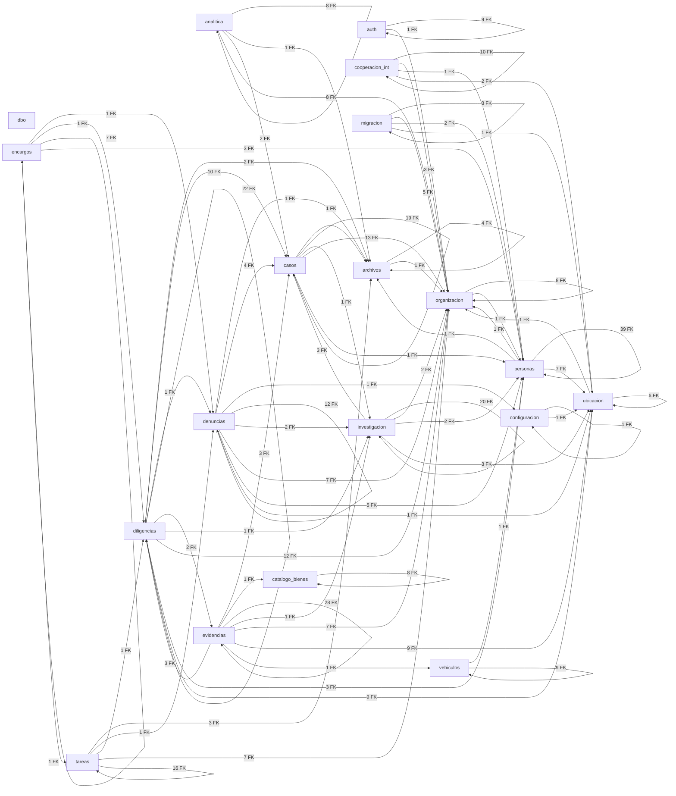

# Mapa Visual: Relaciones entre Esquemas (SIP)

Version artefacto: 1.0.0
Generado: 2026-07-28 16:47:19
Fuente: Proyectos/sip-bd-migrations/compare/source.dacpac

Total tablas detectadas: 230
Total relaciones FK detectadas: 399
