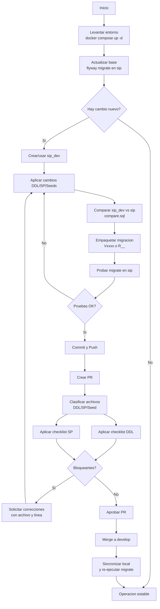

# Flowchart Integral: Operacion + Desarrollo + Revision

## Uso recomendado

1. Usar las vistas separadas para analisis puntual por rol.
2. Usar este flowchart para onboarding, gobernanza y coordinacion de equipo.
