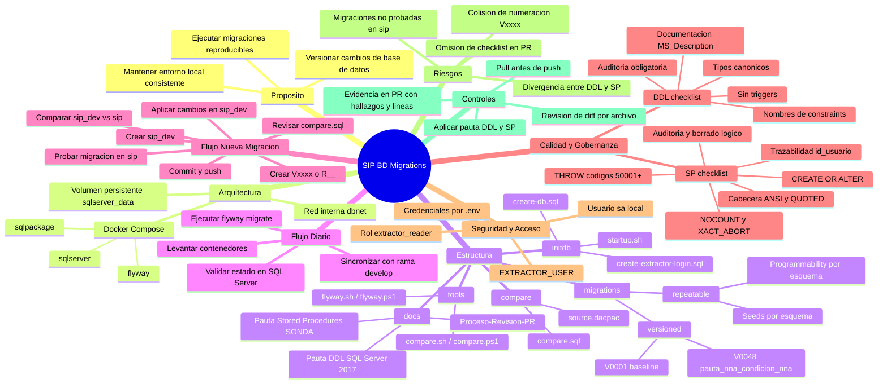

# Mapa Mental: sip-bd-migrations

```mermaid
mindmap
  root((SIP BD Migrations))
    Proposito
      Versionar cambios de base de datos
      Ejecutar migraciones reproducibles
      Mantener entorno local consistente
    Arquitectura
      Docker Compose
        sqlserver
        flyway
        sqlpackage
      Red interna dbnet
      Volumen persistente sqlserver_data
    Estructura
      migrations
        versioned
          V0001 baseline
          V0048 pauta_nna_condicion_nna
        repeatable
          Seeds por esquema
          Programmability por esquema
      initdb
        create-db.sql
        create-extractor-login.sql
        startup.sh
      tools
        flyway.sh / flyway.ps1
        compare.sh / compare.ps1
      compare
        compare.sql
        source.dacpac
      docs
        Proceso-Revision-PR
        Pauta DDL SQL Server 2017
        Pauta Stored Procedures SONDA
    Flujo Diario
      Levantar contenedores
      Ejecutar flyway migrate
      Validar estado en SQL Server
      Sincronizar con rama develop
    Flujo Nueva Migracion
      Crear sip_dev
      Aplicar cambios en sip_dev
      Comparar sip_dev vs sip
      Revisar compare.sql
      Crear Vxxxx o R__
      Probar migracion en sip
      Commit y push
    Calidad y Gobernanza
      DDL checklist
        Tipos canonicos
        Auditoria obligatoria
        Nombres de constraints
        Sin triggers
        Documentacion MS_Description
      SP checklist
        Cabecera ANSI y QUOTED
        CREATE OR ALTER
        NOCOUNT y XACT_ABORT
        THROW codigos 50001+
        Trazabilidad id_usuario
        Auditoria y borrado logico
    Seguridad y Acceso
      Credenciales por .env
      Usuario sa local
      EXTRACTOR_USER
      Rol extractor_reader
    Riesgos
      Colision de numeracion Vxxxx
      Divergencia entre DDL y SP
      Migraciones no probadas en sip
      Omision de checklist en PR
    Controles
      Pull antes de push
      Revision de diff por archivo
      Aplicar pauta DDL y SP
      Evidencia en PR con hallazgos y lineas
```

## Nota

Este mapa mental resume la implementacion actual del repositorio y su proceso operativo.
