# Mapa Visual por Esquema: catalogo_bienes

Version artefacto: 1.0.0
Generado: 2026-07-28 16:47:19
Fuente: Proyectos/sip-bd-migrations/compare/source.dacpac
Esquemas incluidos: catalogo_bienes

```mermaid
flowchart LR
    N_catalogo_bienes_clase[catalogo_bienes.clase]
    N_catalogo_bienes_codigo_reemplazado[catalogo_bienes.codigo_reemplazado]
    N_catalogo_bienes_familia[catalogo_bienes.familia]
    N_catalogo_bienes_producto[catalogo_bienes.producto]
    N_catalogo_bienes_segmento[catalogo_bienes.segmento]
    N_catalogo_bienes_version_catalogo[catalogo_bienes.version_catalogo]
    N_evidencias_especie[evidencias.especie]
    N_catalogo_bienes_clase -->|catalogo_bienes.fk_clase_familia| N_catalogo_bienes_familia
    N_catalogo_bienes_clase -->|catalogo_bienes.fk_clase_version| N_catalogo_bienes_version_catalogo
    N_catalogo_bienes_codigo_reemplazado -->|catalogo_bienes.fk_codigo_reemplazado_version| N_catalogo_bienes_version_catalogo
    N_catalogo_bienes_familia -->|catalogo_bienes.fk_familia_segmento| N_catalogo_bienes_segmento
    N_catalogo_bienes_familia -->|catalogo_bienes.fk_familia_version| N_catalogo_bienes_version_catalogo
    N_catalogo_bienes_producto -->|catalogo_bienes.fk_producto_clase| N_catalogo_bienes_clase
    N_catalogo_bienes_producto -->|catalogo_bienes.fk_producto_version| N_catalogo_bienes_version_catalogo
    N_catalogo_bienes_segmento -->|catalogo_bienes.fk_segmento_version| N_catalogo_bienes_version_catalogo
    N_evidencias_especie -->|evidencias.fk_especie_producto| N_catalogo_bienes_producto
```

Tablas incluidas: 7
Relaciones incluidas: 9
