# Mapa Visual por Esquema: cooperacion_int

Version artefacto: 1.0.0
Generado: 2026-07-28 16:47:19
Fuente: Proyectos/sip-bd-migrations/compare/source.dacpac
Esquemas incluidos: cooperacion_int

```mermaid
flowchart LR
    N_cooperacion_int_cat_cooperacion_internacional[cooperacion_int.cat_cooperacion_internacional]
    N_cooperacion_int_cat_elemento_cooperacion_internacional[cooperacion_int.cat_elemento_cooperacion_internacional]
    N_cooperacion_int_entidad_interpol[cooperacion_int.entidad_interpol]
    N_cooperacion_int_estado_solicitud_interpol[cooperacion_int.estado_solicitud_interpol]
    N_cooperacion_int_motivo_solicitud_interpol[cooperacion_int.motivo_solicitud_interpol]
    N_cooperacion_int_solicitud_interpol[cooperacion_int.solicitud_interpol]
    N_cooperacion_int_tipo_consulta_solicitud_interpol[cooperacion_int.tipo_consulta_solicitud_interpol]
    N_organizacion_funcionario[organizacion.funcionario]
    N_personas_persona[personas.persona]
    N_ubicacion_pais[ubicacion.pais]
    N_cooperacion_int_cat_elemento_cooperacion_internacional -->|cooperacion_int.fk_cat_cooperacion_internacional| N_cooperacion_int_cat_cooperacion_internacional
    N_cooperacion_int_motivo_solicitud_interpol -->|cooperacion_int.fk_motivo_cat| N_cooperacion_int_cat_elemento_cooperacion_internacional
    N_cooperacion_int_motivo_solicitud_interpol -->|cooperacion_int.fk_motivo_sol| N_cooperacion_int_solicitud_interpol
    N_cooperacion_int_solicitud_interpol -->|cooperacion_int.fk_sol_calidad_persona| N_cooperacion_int_cat_elemento_cooperacion_internacional
    N_cooperacion_int_solicitud_interpol -->|cooperacion_int.fk_sol_endosador| N_organizacion_funcionario
    N_cooperacion_int_solicitud_interpol -->|cooperacion_int.fk_sol_entidad_receptora| N_cooperacion_int_entidad_interpol
    N_cooperacion_int_solicitud_interpol -->|cooperacion_int.fk_sol_entidad_solicitante| N_cooperacion_int_entidad_interpol
    N_cooperacion_int_solicitud_interpol -->|cooperacion_int.fk_sol_estado| N_cooperacion_int_estado_solicitud_interpol
    N_cooperacion_int_solicitud_interpol -->|cooperacion_int.fk_sol_func_cierra| N_organizacion_funcionario
    N_cooperacion_int_solicitud_interpol -->|cooperacion_int.fk_sol_func_registro| N_organizacion_funcionario
    N_cooperacion_int_solicitud_interpol -->|cooperacion_int.fk_sol_medio| N_cooperacion_int_cat_elemento_cooperacion_internacional
    N_cooperacion_int_solicitud_interpol -->|cooperacion_int.fk_sol_pais_emisor| N_ubicacion_pais
    N_cooperacion_int_solicitud_interpol -->|cooperacion_int.fk_sol_pais_receptor| N_ubicacion_pais
    N_cooperacion_int_solicitud_interpol -->|cooperacion_int.fk_sol_persona| N_personas_persona
    N_cooperacion_int_tipo_consulta_solicitud_interpol -->|cooperacion_int.fk_tipo_consulta_cat| N_cooperacion_int_cat_elemento_cooperacion_internacional
    N_cooperacion_int_tipo_consulta_solicitud_interpol -->|cooperacion_int.fk_tipo_consulta_sol| N_cooperacion_int_solicitud_interpol
```

Tablas incluidas: 10
Relaciones incluidas: 16
