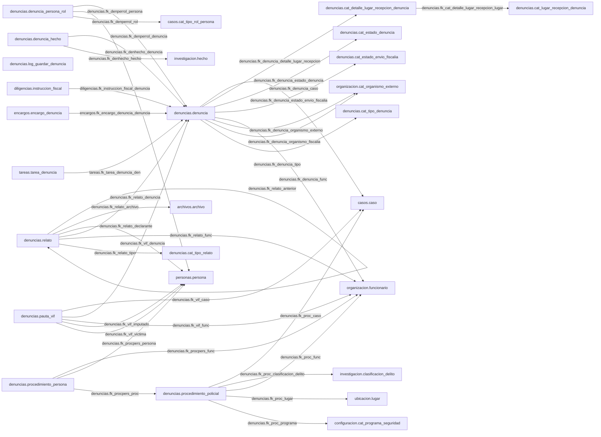

# Mapa Visual por Esquema: denuncias

Version artefacto: 1.0.0
Generado: 2026-07-28 16:47:19
Fuente: Proyectos/sip-bd-migrations/compare/source.dacpac
Esquemas incluidos: denuncias

Tablas incluidas: 27
Relaciones incluidas: 36
