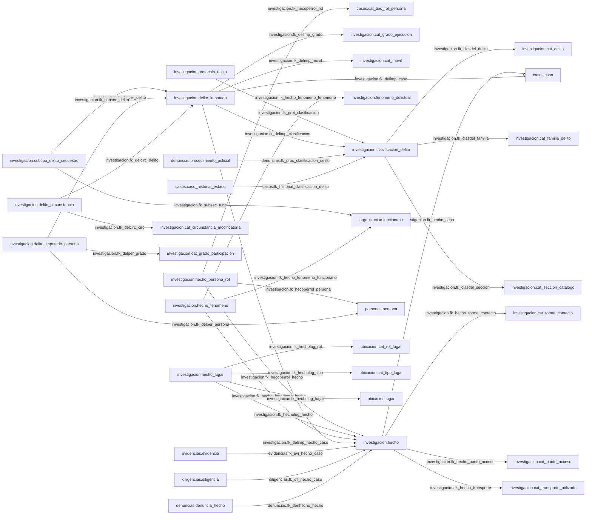

# Mapa Visual por Esquema: investigacion

Version artefacto: 1.0.0
Generado: 2026-07-28 16:47:19
Fuente: Proyectos/sip-bd-migrations/compare/source.dacpac
Esquemas incluidos: investigacion

Tablas incluidas: 33
Relaciones incluidas: 35
