# Mapa Visual por Esquema: organizacion

Version artefacto: 1.0.0
Generado: 2026-07-28 16:47:19
Fuente: Proyectos/sip-bd-migrations/compare/source.dacpac
Esquemas incluidos: organizacion

```mermaid
flowchart LR
    N_analitica_foco_caso[analitica.foco_caso]
    N_analitica_foco_investigativo[analitica.foco_investigativo]
    N_analitica_matriz_analisis[analitica.matriz_analisis]
    N_analitica_reporte_analitico[analitica.reporte_analitico]
    N_analitica_vinculo_entidad[analitica.vinculo_entidad]
    N_archivos_archivo[archivos.archivo]
    N_auth_usuario[auth.usuario]
    N_casos_agrupacion_causa[casos.agrupacion_causa]
    N_casos_agrupacion_causa_caso[casos.agrupacion_causa_caso]
    N_casos_asignacion_funcionario[casos.asignacion_funcionario]
    N_casos_carpeta[casos.carpeta]
    N_casos_carpeta_colaborador[casos.carpeta_colaborador]
    N_casos_caso_historial_estado[casos.caso_historial_estado]
    N_casos_caso_persona_rol[casos.caso_persona_rol]
    N_casos_matriz_riesgo[casos.matriz_riesgo]
    N_cooperacion_int_solicitud_interpol[cooperacion_int.solicitud_interpol]
    N_denuncias_denuncia[denuncias.denuncia]
    N_denuncias_pauta_vif[denuncias.pauta_vif]
    N_denuncias_procedimiento_persona[denuncias.procedimiento_persona]
    N_denuncias_procedimiento_policial[denuncias.procedimiento_policial]
    N_denuncias_relato[denuncias.relato]
    N_diligencias_actividad_investigativa[diligencias.actividad_investigativa]
    N_diligencias_detencion[diligencias.detencion]
    N_diligencias_diligencia[diligencias.diligencia]
    N_diligencias_informe_policial[diligencias.informe_policial]
    N_diligencias_instruccion_fiscal[diligencias.instruccion_fiscal]
    N_diligencias_notificacion_externa[diligencias.notificacion_externa]
    N_diligencias_orden_arresto[diligencias.orden_arresto]
    N_diligencias_orden_detencion[diligencias.orden_detencion]
    N_diligencias_peritaje[diligencias.peritaje]
    N_diligencias_solicitud_concurrencia_pericial[diligencias.solicitud_concurrencia_pericial]
    N_diligencias_solicitud_concurrencia_perito[diligencias.solicitud_concurrencia_perito]
    N_evidencias_cadena_custodia[evidencias.cadena_custodia]
    N_evidencias_especie_historial_estado[evidencias.especie_historial_estado]
    N_evidencias_especie_sello[evidencias.especie_sello]
    N_evidencias_evidencia[evidencias.evidencia]
    N_evidencias_incautacion[evidencias.incautacion]
    N_investigacion_hecho_fenomeno[investigacion.hecho_fenomeno]
    N_investigacion_subtipo_delito_secuestro[investigacion.subtipo_delito_secuestro]
    N_migracion_denuncia_administrativa_migratoria[migracion.denuncia_administrativa_migratoria]
    N_migracion_expulsion[migracion.expulsion]
    N_migracion_fiscalizacion_planificada[migracion.fiscalizacion_planificada]
    N_organizacion_cat_cargo_funcion[organizacion.cat_cargo_funcion]
    N_organizacion_cat_nivel_organismo[organizacion.cat_nivel_organismo]
    N_organizacion_cat_organismo_externo[organizacion.cat_organismo_externo]
    N_organizacion_cat_tipo_organismo[organizacion.cat_tipo_organismo]
    N_organizacion_cat_tipo_relacion_unidad[organizacion.cat_tipo_relacion_unidad]
    N_organizacion_cat_tipo_unidad[organizacion.cat_tipo_unidad]
    N_organizacion_funcionario[organizacion.funcionario]
    N_organizacion_relacion_unidad[organizacion.relacion_unidad]
    N_organizacion_unidad[organizacion.unidad]
    N_personas_anotacion[personas.anotacion]
    N_personas_persona[personas.persona]
    N_tareas_bandeja[tareas.bandeja]
    N_tareas_documento[tareas.documento]
    N_tareas_estado_tarea[tareas.estado_tarea]
    N_tareas_version_documento[tareas.version_documento]
    N_ubicacion_lugar_base[ubicacion.lugar_base]
    N_analitica_foco_investigativo -->|analitica.fk_foco_func| N_organizacion_funcionario
    N_analitica_foco_investigativo -->|analitica.fk_foco_unidad| N_organizacion_unidad
    N_analitica_foco_caso -->|analitica.fk_fococaso_func| N_organizacion_funcionario
    N_analitica_matriz_analisis -->|analitica.fk_matran_func| N_organizacion_funcionario
    N_analitica_reporte_analitico -->|analitica.fk_reporte_aprueba| N_organizacion_funcionario
    N_analitica_reporte_analitico -->|analitica.fk_reporte_autor| N_organizacion_funcionario
    N_analitica_reporte_analitico -->|analitica.fk_reporte_unidad| N_organizacion_unidad
    N_analitica_vinculo_entidad -->|analitica.fk_vincent_func| N_organizacion_funcionario
    N_archivos_archivo -->|archivos.fk_archivo_funcionario| N_organizacion_funcionario
    N_auth_usuario -->|auth.fk_usuario_funcionario| N_organizacion_funcionario
    N_casos_agrupacion_causa_caso -->|casos.fk_agrcasocaso_func| N_organizacion_funcionario
    N_casos_agrupacion_causa -->|casos.fk_agrcausa_aprueba| N_organizacion_funcionario
    N_casos_agrupacion_causa -->|casos.fk_agrcausa_solicita| N_organizacion_funcionario
    N_casos_asignacion_funcionario -->|casos.fk_asignfunc_cargo| N_organizacion_cat_cargo_funcion
    N_casos_asignacion_funcionario -->|casos.fk_asignfunc_func| N_organizacion_funcionario
    N_casos_carpeta -->|casos.fk_carpeta_funcionario| N_organizacion_funcionario
    N_casos_carpeta -->|casos.fk_carpeta_unidad| N_organizacion_unidad
    N_casos_caso_persona_rol -->|casos.fk_caso_persona_rol_defensor| N_organizacion_funcionario
    N_casos_carpeta_colaborador -->|casos.fk_colabcarp_func| N_organizacion_funcionario
    N_casos_carpeta_colaborador -->|casos.fk_colabcarp_invitador| N_organizacion_funcionario
    N_casos_caso_historial_estado -->|casos.fk_histcaso_func| N_organizacion_funcionario
    N_casos_matriz_riesgo -->|casos.fk_matriesgo_aprueba| N_organizacion_funcionario
    N_casos_matriz_riesgo -->|casos.fk_matriesgo_elabora| N_organizacion_funcionario
    N_cooperacion_int_solicitud_interpol -->|cooperacion_int.fk_sol_endosador| N_organizacion_funcionario
    N_cooperacion_int_solicitud_interpol -->|cooperacion_int.fk_sol_func_cierra| N_organizacion_funcionario
    N_cooperacion_int_solicitud_interpol -->|cooperacion_int.fk_sol_func_registro| N_organizacion_funcionario
    N_denuncias_denuncia -->|denuncias.fk_denuncia_func| N_organizacion_funcionario
    N_denuncias_denuncia -->|denuncias.fk_denuncia_organismo_externo| N_organizacion_cat_organismo_externo
    N_denuncias_denuncia -->|denuncias.fk_denuncia_organismo_fiscalia| N_organizacion_cat_organismo_externo
    N_denuncias_procedimiento_policial -->|denuncias.fk_proc_func| N_organizacion_funcionario
    N_denuncias_procedimiento_persona -->|denuncias.fk_procpers_func| N_organizacion_funcionario
    N_denuncias_relato -->|denuncias.fk_relato_func| N_organizacion_funcionario
    N_denuncias_pauta_vif -->|denuncias.fk_vif_func| N_organizacion_funcionario
    N_diligencias_actividad_investigativa -->|diligencias.fk_act_funcionario| N_organizacion_funcionario
    N_diligencias_detencion -->|diligencias.fk_det_func| N_organizacion_funcionario
    N_diligencias_detencion -->|diligencias.fk_det_unidad| N_organizacion_unidad
    N_diligencias_diligencia -->|diligencias.fk_dil_func| N_organizacion_funcionario
    N_diligencias_informe_policial -->|diligencias.fk_inf_func| N_organizacion_funcionario
    N_diligencias_instruccion_fiscal -->|diligencias.fk_instfisc_unid| N_organizacion_unidad
    N_diligencias_notificacion_externa -->|diligencias.fk_notif_func| N_organizacion_funcionario
    N_diligencias_orden_arresto -->|diligencias.fk_oa_func| N_organizacion_funcionario
    N_diligencias_orden_detencion -->|diligencias.fk_od_func| N_organizacion_funcionario
    N_diligencias_peritaje -->|diligencias.fk_per_func| N_organizacion_funcionario
    N_diligencias_solicitud_concurrencia_pericial -->|diligencias.fk_solper_func| N_organizacion_funcionario
    N_diligencias_solicitud_concurrencia_perito -->|diligencias.fk_solperito_func| N_organizacion_funcionario
    N_evidencias_cadena_custodia -->|evidencias.fk_cc_func_dest| N_organizacion_funcionario
    N_evidencias_cadena_custodia -->|evidencias.fk_cc_func_orig| N_organizacion_funcionario
    N_evidencias_especie_historial_estado -->|evidencias.fk_esphist_func| N_organizacion_funcionario
    N_evidencias_evidencia -->|evidencias.fk_evi_func| N_organizacion_funcionario
    N_evidencias_incautacion -->|evidencias.fk_incaut_func| N_organizacion_funcionario
    N_evidencias_incautacion -->|evidencias.fk_incaut_func_incautacion| N_organizacion_funcionario
    N_evidencias_especie_sello -->|evidencias.fk_sello_func| N_organizacion_funcionario
    N_investigacion_hecho_fenomeno -->|investigacion.fk_hecho_fenomeno_funcionario| N_organizacion_funcionario
    N_investigacion_subtipo_delito_secuestro -->|investigacion.fk_subsec_func| N_organizacion_funcionario
    N_migracion_denuncia_administrativa_migratoria -->|migracion.fk_denmig_func| N_organizacion_funcionario
    N_migracion_denuncia_administrativa_migratoria -->|migracion.fk_denmig_unidad| N_organizacion_unidad
    N_migracion_expulsion -->|migracion.fk_exp_func| N_organizacion_funcionario
    N_migracion_fiscalizacion_planificada -->|migracion.fk_fisc_func| N_organizacion_funcionario
    N_migracion_fiscalizacion_planificada -->|migracion.fk_fisc_unidad| N_organizacion_unidad
    N_organizacion_cat_organismo_externo -->|organizacion.fk_cat_organismo_externo_nivel| N_organizacion_cat_nivel_organismo
    N_organizacion_cat_organismo_externo -->|organizacion.fk_cat_organismo_externo_tipo| N_organizacion_cat_tipo_organismo
    N_organizacion_funcionario -->|organizacion.fk_func_cargo| N_organizacion_cat_cargo_funcion
    N_organizacion_funcionario -->|organizacion.fk_func_persona| N_personas_persona
    N_organizacion_funcionario -->|organizacion.fk_func_unidad| N_organizacion_unidad
    N_organizacion_relacion_unidad -->|organizacion.fk_relunidad_hija| N_organizacion_unidad
    N_organizacion_relacion_unidad -->|organizacion.fk_relunidad_padre| N_organizacion_unidad
    N_organizacion_relacion_unidad -->|organizacion.fk_relunidad_tipo| N_organizacion_cat_tipo_relacion_unidad
    N_organizacion_unidad -->|organizacion.fk_unidad_tipo| N_organizacion_cat_tipo_unidad
    N_personas_anotacion -->|personas.fk_anotacion_funcionario| N_organizacion_funcionario
    N_tareas_bandeja -->|tareas.fk_bandeja_funcionario| N_organizacion_funcionario
    N_tareas_bandeja -->|tareas.fk_bandeja_unidad| N_organizacion_unidad
    N_tareas_documento -->|tareas.fk_documento_funcionario_anu| N_organizacion_funcionario
    N_tareas_documento -->|tareas.fk_documento_funcionario_reg| N_organizacion_funcionario
    N_tareas_estado_tarea -->|tareas.fk_estado_funcionario| N_organizacion_funcionario
    N_tareas_version_documento -->|tareas.fk_version_funcionario| N_organizacion_funcionario
    N_tareas_version_documento -->|tareas.fk_version_funcionario_visa| N_organizacion_funcionario
    N_ubicacion_lugar_base -->|ubicacion.fk_lugar_base_funcionario_registro| N_organizacion_funcionario
```

Tablas incluidas: 58
Relaciones incluidas: 77
