# Mapa Visual por Esquema: ubicacion

Version artefacto: 1.0.0
Generado: 2026-07-28 16:47:19
Fuente: Proyectos/sip-bd-migrations/compare/source.dacpac
Esquemas incluidos: ubicacion

```mermaid
flowchart LR
    N_configuracion_cat_programa_seguridad[configuracion.cat_programa_seguridad]
    N_cooperacion_int_solicitud_interpol[cooperacion_int.solicitud_interpol]
    N_denuncias_procedimiento_policial[denuncias.procedimiento_policial]
    N_diligencias_detencion[diligencias.detencion]
    N_diligencias_detencion_lugar[diligencias.detencion_lugar]
    N_diligencias_diligencia[diligencias.diligencia]
    N_diligencias_diligencia_lugar[diligencias.diligencia_lugar]
    N_diligencias_solicitud_concurrencia_pericial[diligencias.solicitud_concurrencia_pericial]
    N_evidencias_especie_lugar[evidencias.especie_lugar]
    N_evidencias_evidencia[evidencias.evidencia]
    N_evidencias_evidencia_lugar[evidencias.evidencia_lugar]
    N_evidencias_incautacion[evidencias.incautacion]
    N_investigacion_hecho_lugar[investigacion.hecho_lugar]
    N_migracion_expulsion[migracion.expulsion]
    N_organizacion_funcionario[organizacion.funcionario]
    N_personas_empleo[personas.empleo]
    N_personas_identificacion[personas.identificacion]
    N_personas_persona[personas.persona]
    N_personas_persona_lugar[personas.persona_lugar]
    N_ubicacion_cat_rol_lugar[ubicacion.cat_rol_lugar]
    N_ubicacion_cat_tipo_calle[ubicacion.cat_tipo_calle]
    N_ubicacion_cat_tipo_lugar[ubicacion.cat_tipo_lugar]
    N_ubicacion_cat_tipo_residencia[ubicacion.cat_tipo_residencia]
    N_ubicacion_cat_tipo_subdivision[ubicacion.cat_tipo_subdivision]
    N_ubicacion_comuna[ubicacion.comuna]
    N_ubicacion_lugar[ubicacion.lugar]
    N_ubicacion_lugar_base[ubicacion.lugar_base]
    N_ubicacion_pais[ubicacion.pais]
    N_ubicacion_provincia[ubicacion.provincia]
    N_ubicacion_region[ubicacion.region]
    N_configuracion_cat_programa_seguridad -->|configuracion.fk_progseq_comuna| N_ubicacion_comuna
    N_cooperacion_int_solicitud_interpol -->|cooperacion_int.fk_sol_pais_emisor| N_ubicacion_pais
    N_cooperacion_int_solicitud_interpol -->|cooperacion_int.fk_sol_pais_receptor| N_ubicacion_pais
    N_denuncias_procedimiento_policial -->|denuncias.fk_proc_lugar| N_ubicacion_lugar
    N_diligencias_detencion -->|diligencias.fk_det_lugar| N_ubicacion_lugar
    N_diligencias_detencion_lugar -->|diligencias.fk_detlug_lug| N_ubicacion_lugar
    N_diligencias_detencion_lugar -->|diligencias.fk_detlug_rol| N_ubicacion_cat_rol_lugar
    N_diligencias_detencion_lugar -->|diligencias.fk_detlug_tipo| N_ubicacion_cat_tipo_lugar
    N_diligencias_diligencia -->|diligencias.fk_dil_lugar| N_ubicacion_lugar
    N_diligencias_diligencia_lugar -->|diligencias.fk_dillug_lug| N_ubicacion_lugar
    N_diligencias_diligencia_lugar -->|diligencias.fk_dillug_rol| N_ubicacion_cat_rol_lugar
    N_diligencias_diligencia_lugar -->|diligencias.fk_dillug_tipo| N_ubicacion_cat_tipo_lugar
    N_diligencias_solicitud_concurrencia_pericial -->|diligencias.fk_solper_lugar| N_ubicacion_lugar
    N_evidencias_especie_lugar -->|evidencias.fk_esplug_lug| N_ubicacion_lugar
    N_evidencias_especie_lugar -->|evidencias.fk_esplug_rol| N_ubicacion_cat_rol_lugar
    N_evidencias_especie_lugar -->|evidencias.fk_esplug_tipo| N_ubicacion_cat_tipo_lugar
    N_evidencias_evidencia -->|evidencias.fk_evi_lugar| N_ubicacion_lugar
    N_evidencias_evidencia_lugar -->|evidencias.fk_evilug_lug| N_ubicacion_lugar
    N_evidencias_evidencia_lugar -->|evidencias.fk_evilug_rol| N_ubicacion_cat_rol_lugar
    N_evidencias_evidencia_lugar -->|evidencias.fk_evilug_tipo| N_ubicacion_cat_tipo_lugar
    N_evidencias_incautacion -->|evidencias.fk_incaut_lugar| N_ubicacion_lugar
    N_evidencias_incautacion -->|evidencias.fk_incautacion_region| N_ubicacion_region
    N_investigacion_hecho_lugar -->|investigacion.fk_hecholug_lugar| N_ubicacion_lugar
    N_investigacion_hecho_lugar -->|investigacion.fk_hecholug_rol| N_ubicacion_cat_rol_lugar
    N_investigacion_hecho_lugar -->|investigacion.fk_hecholug_tipo| N_ubicacion_cat_tipo_lugar
    N_migracion_expulsion -->|migracion.fk_exp_pais| N_ubicacion_pais
    N_personas_empleo -->|personas.fk_empleo_lugar| N_ubicacion_lugar
    N_personas_identificacion -->|personas.fk_ident_pais| N_ubicacion_pais
    N_personas_persona_lugar -->|personas.fk_perlug_lugar| N_ubicacion_lugar
    N_personas_persona_lugar -->|personas.fk_perlug_rol| N_ubicacion_cat_rol_lugar
    N_personas_persona_lugar -->|personas.fk_perlug_tipo| N_ubicacion_cat_tipo_lugar
    N_personas_persona -->|personas.fk_persona_comuna_nac| N_ubicacion_comuna
    N_personas_persona -->|personas.fk_persona_pais| N_ubicacion_pais
    N_ubicacion_comuna -->|ubicacion.fk_comuna_provincia| N_ubicacion_provincia
    N_ubicacion_lugar -->|ubicacion.fk_lugar_base| N_ubicacion_lugar_base
    N_ubicacion_lugar_base -->|ubicacion.fk_lugar_base_comuna| N_ubicacion_comuna
    N_ubicacion_lugar_base -->|ubicacion.fk_lugar_base_funcionario_registro| N_organizacion_funcionario
    N_ubicacion_lugar -->|ubicacion.fk_lugar_tipo_subdivision| N_ubicacion_cat_tipo_subdivision
    N_ubicacion_provincia -->|ubicacion.fk_provincia_region| N_ubicacion_region
    N_ubicacion_region -->|ubicacion.fk_region_pais| N_ubicacion_pais
```

Tablas incluidas: 30
Relaciones incluidas: 40
