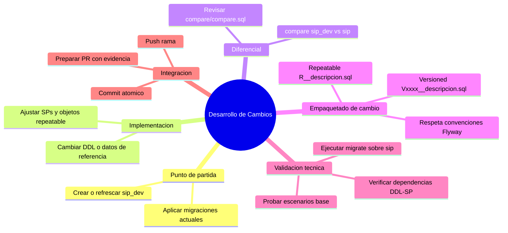

# Vista: Desarrollo (sip-bd-migrations)

```mermaid
mindmap
  root((Desarrollo de Cambios))
    Punto de partida
      Crear o refrescar sip_dev
      Aplicar migraciones actuales
    Implementacion
      Cambiar DDL o datos de referencia
      Ajustar SPs y objetos repeatable
    Diferencial
      compare sip_dev vs sip
      Revisar compare/compare.sql
    Empaquetado de cambio
      Versioned Vxxxx__descripcion.sql
      Repeatable R__descripcion.sql
      Respeta convenciones Flyway
    Validacion tecnica
      Ejecutar migrate sobre sip
      Verificar dependencias DDL-SP
      Probar escenarios base
    Integracion
      Commit atomico
      Push rama
      Preparar PR con evidencia
```

## Resultado esperado

Cambio trazable, migrable y compatible con el flujo de integracion.
