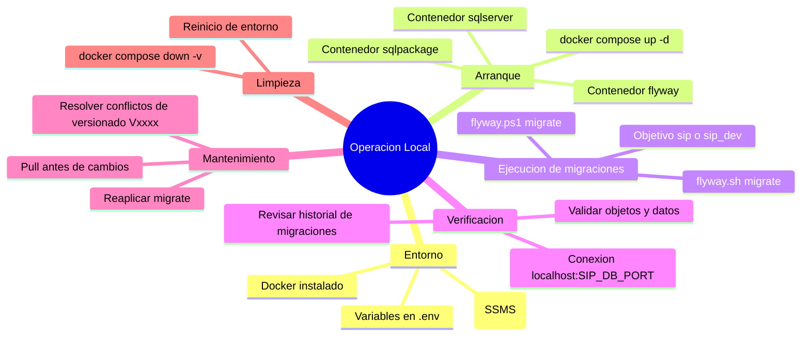

# Vista: Operacion (sip-bd-migrations)

```mermaid
mindmap
  root((Operacion Local))
    Entorno
      Docker instalado
      SQL Client (SSMS)
      Variables en .env
    Arranque
      docker compose up -d
      Contenedor sqlserver
      Contenedor flyway
      Contenedor sqlpackage
    Ejecucion de migraciones
      flyway.sh migrate
      flyway.ps1 migrate
      Objetivo sip o sip_dev
    Verificacion
      Conexion localhost:SIP_DB_PORT
      Validar objetos y datos
      Revisar historial de migraciones
    Mantenimiento
      Pull antes de cambios
      Reaplicar migrate
      Resolver conflictos de versionado Vxxxx
    Limpieza
      docker compose down -v
      Reinicio de entorno
```

## Resultado esperado

Entorno reproducible, base local actualizada y lista para desarrollo/revision.
