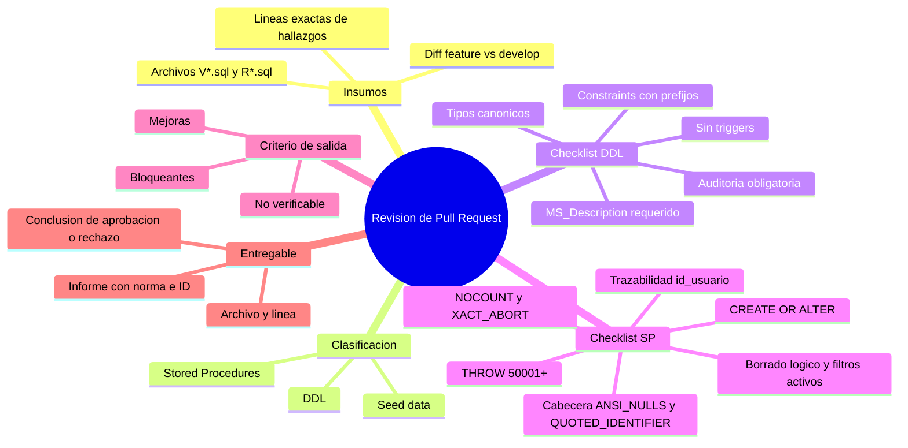

# Vista: Revision PR (sip-bd-migrations)

```mermaid
mindmap
  root((Revision de Pull Request))
    Insumos
      Diff feature vs develop
      Archivos V*.sql y R*.sql
      Lineas exactas de hallazgos
    Clasificacion
      DDL
      Stored Procedures
      Seed data
    Checklist DDL
      Tipos canonicos
      Auditoria obligatoria
      Constraints con prefijos
      Sin triggers
      MS_Description requerido
    Checklist SP
      Cabecera ANSI_NULLS y QUOTED_IDENTIFIER
      CREATE OR ALTER
      NOCOUNT y XACT_ABORT
      THROW 50001+
      Trazabilidad id_usuario
      Borrado logico y filtros activos
    Criterio de salida
      Bloqueantes
      Mejoras
      No verificable
    Entregable
      Informe con norma e ID
      Archivo y linea
      Conclusion de aprobacion o rechazo
```

## Resultado esperado

Revision consistente con pautas, minimizando deuda tecnica y riesgo de regresiones.
