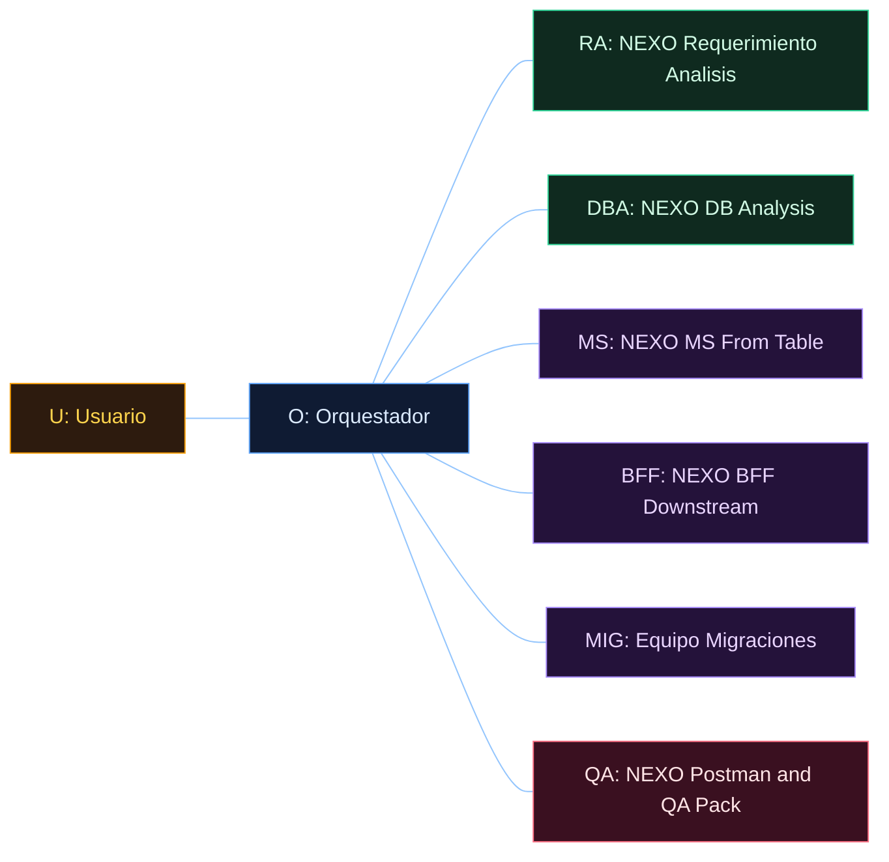
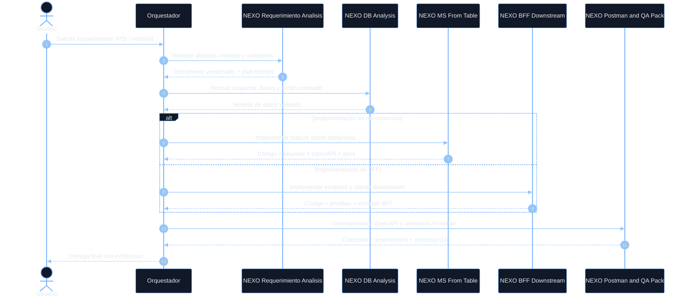
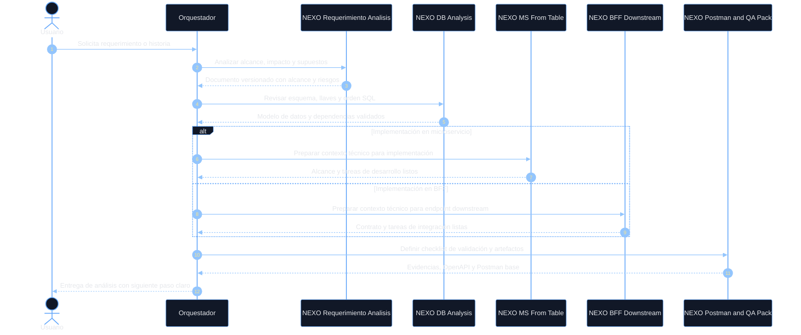
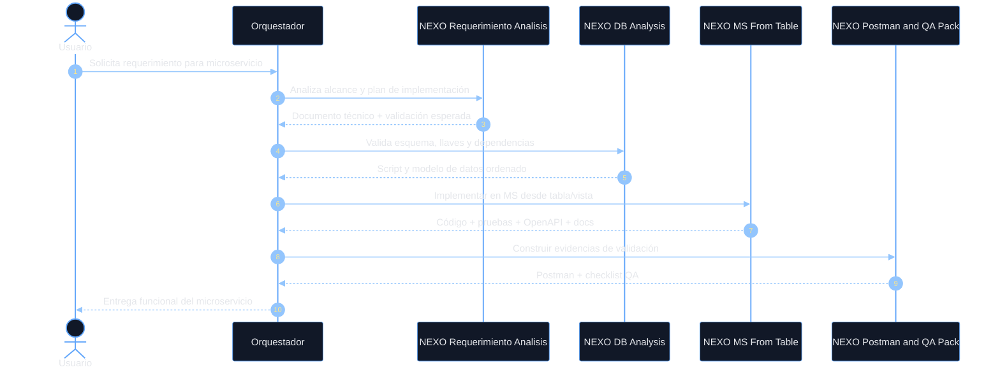
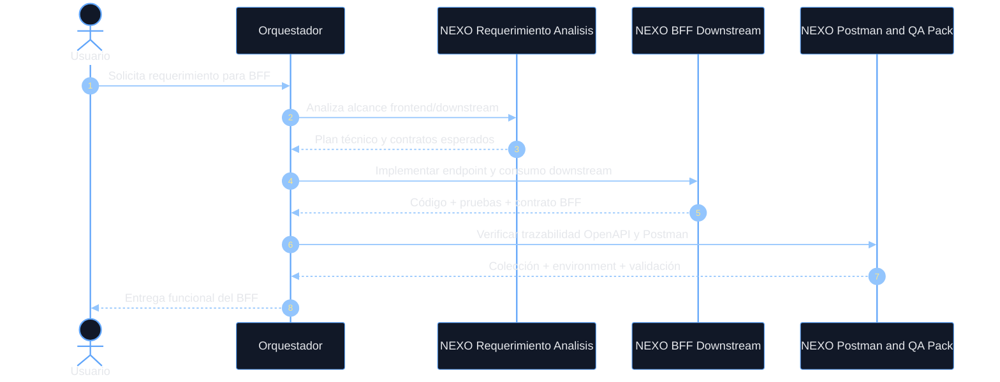
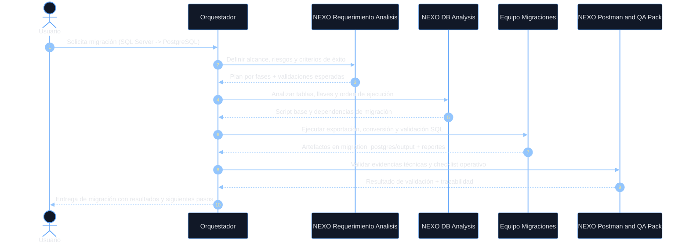

# Workspace of reference projects and artifacts

Este directorio centraliza los proyectos, documentos, plantillas y recursos de apoyo relacionados con la arquitectura, operación y entrega del portafolio NEXO, además de componentes de diseño, migración y gobierno.

## Propósito

Este README funciona como punto de entrada para entender:

- qué proyectos existen en el workspace,
- qué repositorios y artefactos están asociados a cada iniciativa,
- qué documentación, agentes y configuraciones deben consultarse antes de modificar o extender el entorno,
- qué herramientas y flujos operativos se usan para desarrollo, despliegue y validación.

## Indice

1. Contexto y mapa:
[Mapa general del workspace](#mapa-general-del-workspace)
[Proyectos principales](#proyectos-principales)
[Soportes y artefactos transversales](#soportes-y-artefactos-transversales)

2. Onboarding funcional y tecnico:
[Guia rapida util: MentalF, Figma y Vistas](#guia-rapida-util-mentalf-figma-y-vistas)
[Tabla comparativa de onboarding rapido](#tabla-comparativa-de-onboarding-rapido)
[MentalF (mapa tecnico y diagrama BD)](#mentalf-mapa-tecnico-y-diagrama-bd)
[Figma (propuestas de diseno y especificaciones)](#figma-propuestas-de-diseno-y-especificaciones)
[Vistas (prototipado local BD/UI)](#vistas-prototipado-local-bdui)
[Requerimientos (analisis funcional y tecnico)](#requerimientos-analisis-funcional-y-tecnico)
[Recomendacion practica de uso conjunto](#recomendacion-practica-de-uso-conjunto)

3. Flujo de agentes y ejecucion:
[Agentes, instrucciones y estandares](#agentes-instrucciones-y-estandares)
[Documentos de referencia principales](#documentos-de-referencia-principales)
[Repositorios con instrucciones especificas](#repositorios-con-instrucciones-especificas)
[Diagrama de secuencia de agentes NEXO](#diagrama-de-secuencia-de-agentes-nexo)
[Diagrama de secuencia de análisis](#diagrama-de-secuencia-de-análisis)
[Análisis de requerimiento](#análisis-de-requerimiento)
[Casos de uso y ejemplos de consumo](#casos-de-uso-y-ejemplos-de-consumo)
[Leyenda visual de roles y agentes](#leyenda-visual-de-roles-y-agentes)
[Flujo separado: Microservicio (MS)](#flujo-separado-microservicio-ms)
[Flujo separado: BFF](#flujo-separado-bff)
[Flujo separado: Migraciones](#flujo-separado-migraciones)
[Casos de uso y ejemplos de consumo](#casos-de-uso-y-ejemplos-de-consumo)
[Ejemplo 1: consumo principal (MS desde requerimiento real)](#ejemplo-1-consumo-principal-ms-desde-requerimiento-real)
[Ejemplo 2: consumo BD + migraciones (tabla/instrucciones)](#ejemplo-2-consumo-bd--migraciones-tablainstrucciones)
[Ejemplo 3: consumo BFF downstream (bandeja investigador)](#ejemplo-3-consumo-bff-downstream-bandeja-investigador)
[Plantillas reutilizables de prompt (Analisis, MS, BFF, DB)](#plantillas-reutilizables-de-prompt-analisis-ms-bff-db)
[Plantilla Analisis de requerimiento](#plantilla-analisis-de-requerimiento)
[Plantilla MS (microservicio)](#plantilla-ms-microservicio)
[Plantilla BFF (downstream)](#plantilla-bff-downstream)
[Plantilla DB + migraciones](#plantilla-db--migraciones)
[Diseno y prompts de apoyo](#diseno-y-prompts-de-apoyo)

4. Operacion diaria:
[Configuraciones y artefactos de operacion](#configuraciones-y-artefactos-de-operacion)
[Contenedores y entorno local](#contenedores-y-entorno-local)
[Pipelines y automatizacion](#pipelines-y-automatizacion)
[Migracion y validacion](#migracion-y-validacion)
[Plan de trabajo diario y uso de la herramienta](#plan-de-trabajo-diario-y-uso-de-la-herramienta)
[Plan semanal sugerido (lunes a viernes)](#plan-semanal-sugerido-lunes-a-viernes)
[Rutina diaria sugerida (practica)](#rutina-diaria-sugerida-practica)
[Uso de la herramienta en el dia a dia](#uso-de-la-herramienta-en-el-dia-a-dia)
[Herramienta de registro diario (cuadricula calendario)](#herramienta-de-registro-diario-cuadricula-calendario)
[Checklist de cierre diario](#checklist-de-cierre-diario)
[Reglas recomendadas de trabajo](#reglas-recomendadas-de-trabajo)
[Siguiente paso sugerido](#siguiente-paso-sugerido)

## Mapa general del workspace

### Proyectos principales

- [Proyectos](./Proyectos/) – contenedor principal de los repositorios y estándares técnicos del ecosistema NEXO.
- [Proyectos/estandares-tecnicos](./Proyectos/estandares-tecnicos/) – guía de buenas prácticas, arquitectura y flujo de trabajo local.
- [Proyectos/nexo-bff-diligencias](./Proyectos/nexo-bff-diligencias/) – backend BFF para diligencias.
- [Proyectos/nexo-ms-encargos](./Proyectos/nexo-ms-encargos/) – microservicio de encargos con instrucciones específicas de trabajo local.
- [Proyectos/nexo-ms-evidencias](./Proyectos/nexo-ms-evidencias/) – repositorio asociado a evidencias.
- [Proyectos/sip-bd-migrations](./Proyectos/sip-bd-migrations/) – migraciones y scripts de base de datos.
- [Proyectos/sip-capacitacion-docker](./Proyectos/sip-capacitacion-docker/) – entorno de capacitación basado en Docker.
- [Proyectos/sip-ms-archivos](./Proyectos/sip-ms-archivos/) – microservicio de archivos.
- [Proyectos/sip-ms-auth](./Proyectos/sip-ms-auth/) – autenticación y seguridad.
- [Proyectos/sip-ms-denuncias](./Proyectos/sip-ms-denuncias/) – microservicio de denuncias.
- [Proyectos/sip-ms-diligencias](./Proyectos/sip-ms-diligencias/) – microservicio de diligencias.
- [Proyectos/sip-ms-investigaciones](./Proyectos/sip-ms-investigaciones/) – microservicio de investigaciones.
- [Proyectos/sip-ms-personas](./Proyectos/sip-ms-personas/) – microservicio de personas.
- [Proyectos/sip-ms-ubicaciones](./Proyectos/sip-ms-ubicaciones/) – microservicio de ubicaciones.
- [Proyectos/sip-web-portal](./Proyectos/sip-web-portal/) – portal web del ecosistema.

### Soportes y artefactos transversales

- [Figma](./Figma/) – propuestas de diseño, prompts y documentación visual.
- [MentalF](./MentalF/) – scripts y versiones para generación de diagramas de base de datos.
- [migration_postgres](./migration_postgres/) – plan y scripts para migración desde SQL Server a PostgreSQL.
- [openproject-community](./openproject-community/) – despliegue local de OpenProject, respaldos y automatización.
- [requerimientos](./requerimientos/) – documentación de requerimientos por PDI.
- [swagger_docs](./swagger_docs/) – documentación de APIs y artefactos de validación.
- [Vistas](./Vistas/) – prototipos y vistas front-end de soporte.
- [_backups](./_backups/) – copias de respaldo y snapshots de proyectos.

### Guía rápida útil: MentalF, Figma y Vistas

Esta sección resume qué usar, cuándo usarlo y dónde están los archivos clave para acelerar trabajo diario.

#### Tabla comparativa de onboarding rápido

| Herramienta | Cuándo usarla | Entrada mínima | Salida esperada | Tiempo estimado inicial |
|---|---|---|---|---|
| Requerimientos (PDI) | Definir alcance funcional/técnico, riesgos y criterio de validación antes de implementar | ID Jira/PDI, contexto de negocio y alcance preliminar | Carpeta versionada por requerimiento con análisis, diseño, estimación y plan de validación | 20-40 min |
| MentalF | Entender modelo BD, relaciones y dependencias antes de MS/BFF | Migraciones actualizadas y alcance funcional (PDI/historia) | Diagramas y vistas técnicas versionadas para análisis | 15-30 min |
| Vistas (v4.1 recomendado) | Prototipar formularios, maestro-detalle y payload local | Schema extraído y tabla/caso de uso objetivo | Pantalla ejecutable local + JSON exportable versionado | 20-45 min |
| Figma | Formalizar propuesta visual y especificaciones para desarrollo | Objetivo UX, audiencia, estilo y componentes clave | Propuesta versionada + análisis + especificaciones técnicas | 30-60 min |

Ruta sugerida para onboarding:

1. Documentar análisis de requerimiento (alcance, supuestos y validación) en `requerimientos/`.
2. Ejecutar MentalF para comprender el modelo de datos.
3. Levantar Vistas v4.1 para validar interacción y estructura.
4. Cerrar en Figma con propuesta y especificaciones.
5. Pasar a implementación MS/BFF con OpenAPI y Postman.

#### MentalF (mapa técnico y diagrama BD)

Cuándo usarlo:

- Cuando se necesita entender estructura de tablas, relaciones y flujo de migraciones antes de tocar MS/BFF.
- Cuando se requiere evidencia visual para análisis técnico o revisión.

Enlaces rápidos:

- [MentalF/README.md](./MentalF/README.md)
- [MentalF/generar-diagrama-bd.ps1](./MentalF/generar-diagrama-bd.ps1)
- [MentalF/versiones/v1.0.0/INSTRUCCIONES-EJECUCION.md](./MentalF/versiones/v1.0.0/INSTRUCCIONES-EJECUCION.md)
- [MentalF/versiones/v1.0.0/DOCUMENTACION.md](./MentalF/versiones/v1.0.0/DOCUMENTACION.md)

Comandos base:

```powershell
powershell.exe -NoProfile -ExecutionPolicy Bypass -File "c:/Projects/MentalF/generar-diagrama-bd.ps1" -Scope all
powershell.exe -NoProfile -ExecutionPolicy Bypass -File "c:/Projects/MentalF/generar-diagrama-bd.ps1" -Scope schema -Schemas diligencias
```

#### Figma (propuestas de diseño y especificaciones)

Cuándo usarlo:

- Cuando se necesita propuesta visual versionada antes de implementación frontend.
- Cuando QA/UX requiere análisis de accesibilidad, coherencia y export de especificaciones.

Enlaces rápidos:

- [Figma/QUICK_START.md](./Figma/QUICK_START.md)
- [Figma/WORKFLOW_VISUAL.md](./Figma/WORKFLOW_VISUAL.md) — flujo visual y prompts alineados al orden del diagrama
- [Figma/prompts/PROMPT_PROPUESTA_DISEÑO.md](./Figma/prompts/PROMPT_PROPUESTA_DISEÑO.md)
- [Figma/prompts/AGENTE_FIGMA_INSTRUCTIONS.md](./Figma/prompts/AGENTE_FIGMA_INSTRUCTIONS.md)
- [Figma/propuestas/TEMPLATE_PROPUESTA.json](./Figma/propuestas/TEMPLATE_PROPUESTA.json)

Flujo corto recomendado:

1. Crear propuesta inicial (v1) — usar el Prompt 1 desde [Figma/QUICK_START.md](./Figma/QUICK_START.md).
2. Analizar propuesta y documentar hallazgos — usar el Prompt 2 desde [Figma/WORKFLOW_VISUAL.md](./Figma/WORKFLOW_VISUAL.md).
3. Decidir si se aprueba o si requiere mejoras — esta decisión marca si se sigue al paso 5 o al paso 4.
4. Iterar (v1.1, v2) según feedback — usar el Prompt 3 para mejorar la propuesta.
5. Exportar especificaciones técnicas para desarrollo — usar el Prompt 4.
6. Versionar y dejar la propuesta lista para desarrollo.

Orden visual de prompts (coincide con el diagrama): crear → analizar → decidir → mejorar → exportar → versionar.

#### Vistas (prototipado local BD/UI)

Cuándo usarlo:

- Cuando se quiere validar rápidamente formularios, maestro-detalle y payload sin esperar frontend completo.
- Cuando se necesita una vista ejecutable local para conversar reglas con negocio/QA.

Enlaces rápidos:

- [Vistas/README.md](./Vistas/README.md)
- [Vistas/v1/README.md](./Vistas/v1/README.md)
- [Vistas/v2/README.md](./Vistas/v2/README.md)
- [Vistas/v3/README.md](./Vistas/v3/README.md)
- [Vistas/v4/README.md](./Vistas/v4/README.md)
- [Vistas/v4.1/README.md](./Vistas/v4.1/README.md)

Arranque recomendado (v4.1):

```powershell
cd c:\Projects\Vistas\v4.1
node server.js
```

URL local:

- [http://localhost:3005](http://localhost:3005)

Integración con migraciones:

- Ejecutar extractor de schema desde cada versión de Vistas cuando cambien migraciones.
- Comando: `./extract-schema-from-sip-migrations.ps1`
- Salida esperada: `data/schema.from.sip-bd-migrations.json`

#### Requerimientos (análisis funcional y técnico)

Cuándo usarlo:

- Cuando el requerimiento aún no tiene alcance cerrado y se necesita una base técnica versionada.
- Cuando se debe dejar trazabilidad por ID (PDI/Jira) antes de implementar en MS, BFF o migraciones.

Enlaces rápidos:

- [requerimientos/README.md](./requerimientos/README.md)
- [requerimientos/PDI-967](./requerimientos/PDI-967/)
- [requerimientos/PDI-1059](./requerimientos/PDI-1059/)
- [requerimientos/PDI-1071](./requerimientos/PDI-1071/)

Flujo corto recomendado:

1. Crear carpeta `{ID}/v{N}` para el requerimiento (por ejemplo, `PDI-1071/v1`).
2. Completar entregables mínimos: contexto, alcance/impacto, diseño técnico-funcional, estimación y plan de validación.
3. Validar supuestos y vacíos antes de tocar código.
4. Referenciar esta versión del análisis en el PR o en la documentación de implementación.

Entregables mínimos por versión:

- `00_contexto_fuente.md`
- `01_analisis_alcance_impacto.md`
- `02_diseno_funcional_tecnico.md`
- `03_estimacion_tiempos.md`
- `04_plan_validacion.md`
- `diagramas/*.puml`

#### Recomendación práctica de uso conjunto

1. Requerimientos para cerrar alcance, supuestos y validación esperada.
2. MentalF para entender modelo y dependencias.
3. Vistas para validar interacción y estructura de pantalla.
4. Figma para cerrar propuesta visual y especificaciones.
5. MS/BFF para implementar contrato, pruebas, OpenAPI y Postman.

## Agentes, instrucciones y estándares

Los repositorios del ecosistema NEXO incluyen documentación y archivos de soporte que deben consultarse antes de implementar cambios.

### Documentos de referencia principales

- [Proyectos/estandares-tecnicos/README.md](./Proyectos/estandares-tecnicos/README.md) – punto de entrada a los estándares técnicos.
- [Proyectos/estandares-tecnicos/forma-de-trabajo-local-agentes.md](./Proyectos/estandares-tecnicos/forma-de-trabajo-local-agentes.md) – guía de trabajo con agentes locales.
- [.github/instructions/nexo-workflow.instructions.md](./.github/instructions/nexo-workflow.instructions.md) – guardrails operativas para cambios en repositorios NEXO.

### Repositorios con instrucciones específicas

- [Proyectos/nexo-ms-encargos/AGENTS.md](./Proyectos/nexo-ms-encargos/AGENTS.md)
- [Proyectos/nexo-ms-encargos/AGENTS.repository.md](./Proyectos/nexo-ms-encargos/AGENTS.repository.md)
- [Proyectos/nexo-ms-encargos/CLAUDE.md](./Proyectos/nexo-ms-encargos/CLAUDE.md)

### Diagrama de secuencia de agentes NEXO

El siguiente flujo resume cómo participa cada agente especializado durante una implementación estándar en repositorios de `Proyectos/`.

#### Leyenda visual de roles y agentes



Referencia rapida:

- U: solicitante funcional del requerimiento.
- O: coordinador del flujo de implementacion y validacion.
- RA: analisis de alcance, impacto y plan tecnico.
- DBA: analisis de esquema, llaves, dependencias y orden SQL.
- MS: implementacion en microservicio basada en tabla o vista.
- BFF: implementacion de endpoint BFF y consumo downstream.
- MIG: ejecucion de tareas de migracion y generacion de reportes.
- QA: validacion final, trazabilidad OpenAPI y artefactos Postman.



#### Diagrama de secuencia de análisis

Este flujo resume la etapa inicial de análisis de alcance, impacto y validación antes de pasar a implementación. Es útil cuando el requerimiento aún está en definición o cuando se necesita dejar una base técnica clara para MS, BFF o migraciones.



---

#### Flujo separado: Microservicio (MS)



---

#### Flujo separado: BFF



---

#### Flujo separado: Migraciones



---

### Casos de uso y ejemplos de consumo

#### Análisis de requerimiento

El análisis de requerimiento es la etapa inicial donde se transforma un pedido o historia en un alcance claro, con supuestos, riesgos, dependencias y criterios de validación. Es el punto de entrada para decidir si el trabajo debe continuar por microservicio, BFF, migración o una combinación de estos caminos.

Cuando aplica:
- Cuando el requerimiento aún no tiene alcance cerrado.
- Cuando se necesita dejar una base técnica versionada antes de implementar.
- Cuando el equipo necesita estimar impacto, riesgos y dependencias.
- Cuando se quiere preparar el contexto para MS, BFF o migraciones sin saltar directamente a código.

Salida esperada:
- Alcance y supuestos explicitados.
- Riesgos y dependencias identificadas.
- Plan técnico inicial y criterios de validación.
- Referencia útil para la siguiente etapa de implementación.

#### Casos de uso

- Requerimientos funcionales nuevos con impacto en MS o BFF.
- Historias que requieren análisis de base de datos o migración SQL.
- Casos donde el negocio necesita entender el alcance antes de construir.
- Escenarios de revisión previa a pull request o implementación.

#### Requerimientos

Este flujo también aplica cuando el punto de entrada es un requerimiento en sí mismo. En esos casos, el objetivo no es solo implementar, sino primero comprender el alcance, los supuestos, los riesgos y la validación esperada antes de pasar a MS, BFF o migraciones.

Cuando usarlo:
- Para convertir un requerimiento en una base técnica clara.
- Para preparar la conversación con negocio, QA o arquitectura.
- Para identificar vacíos funcionales y dependencias antes de construir.
- Para dejar una guía de análisis que sirva como referencia de entrada al desarrollo.

Salida esperada:
- Requerimiento traducido a alcance accionable.
- Supuestos y riesgos documentados.
- Plan de análisis listo para la siguiente etapa.
- Contexto compartido para implementación y validación.

#### Ejemplo 1: análisis de requerimiento (alcance y contexto)

Prompt sugerido:

Analizar PDI-1071 en Proyectos/sip-ms-diligencias y dejar un alcance claro para la implementación futura: identificar supuestos, riesgos, dependencias, criterios de validación y vacíos funcionales antes de pasar a desarrollo.

Salida esperada del agente:

- Alcance y supuestos explicitados.
- Riesgos y dependencias identificadas.
- Criterios de validación definidos.
- Base técnica preparada para la siguiente etapa de implementación.

#### Ejemplo 2: consumo principal (MS desde requerimiento real)

Prompt sugerido:

Implementar PDI-1071 en Proyectos/sip-ms-diligencias: exponer endpoint GET de actividades asociadas a una diligencia. Aplicar flujo NEXO completo con analisis de alcance y validaciones faltantes, implementacion en capas Application/Infrastructure/Api, pruebas unitarias, actualizacion de OpenAPI y artefactos Postman locales.

Salida esperada del agente:

- Analisis de vacios funcionales y supuestos explicitados.
- Implementacion del endpoint y query de datos por idDiligencia.
- Pruebas unitarias para casos con y sin actividades.
- OpenAPI actualizado y validado.
- Coleccion y environment Postman trazables al contrato.

#### Ejemplo 3: consumo BD + migraciones (tabla/instrucciones)

Prompt sugerido:

Tomar PDI-1059 y construir script SQL ordenado para obtener instrucciones de diligencia, identificando tabla o vista origen, llaves y filtros requeridos. Luego preparar migracion SQL Server a PostgreSQL en migration_postgres con reportes de validacion y checklist de ejecucion.

Salida esperada del agente:

- Script SQL base versionado con dependencias resueltas.
- Mapeo SQL Server a PostgreSQL de tipos y funciones.
- Evidencia de conversion en migration_postgres/output.
- Reporte final con riesgos, validaciones y siguientes pasos.

#### Ejemplo 4: consumo BFF downstream (bandeja investigador)

Prompt sugerido:

Implementar soporte BFF para PDI-967 (bandeja de diligencias rol investigador), consumiendo endpoints del MS diligencias, aplicando filtros y mapeo de estados para frontend. Incluir pruebas, ajuste de contrato y artefactos de validacion.

Salida esperada del agente:

- Endpoint BFF alineado al caso de uso de bandeja.
- Cliente downstream con manejo de errores y timeouts del repo.
- Pruebas unitarias del caso de uso y del adaptador HTTP.
- Documentacion y Postman listos para QA funcional.

---

### Plantillas reutilizables de prompt (Analisis, MS, BFF, DB)

Usar estas plantillas como base y reemplazar los campos entre llaves.

#### Plantilla Analisis de requerimiento

Prompt:

Analizar {ID_REQUERIMIENTO} en {RUTA_REPO_OBJETIVO} para {OBJETIVO_FUNCIONAL_O_TECNICO}. Construir una base de analisis antes de implementar: alcance, supuestos, riesgos, dependencias, vacios funcionales, criterios de validacion y siguiente paso recomendado (MS, BFF o migracion). No implementar codigo en esta etapa; dejar el contexto listo para ejecucion.

Campos a completar:

- ID_REQUERIMIENTO: ejemplo PDI-1071.
- RUTA_REPO_OBJETIVO: ejemplo Proyectos/sip-ms-diligencias.
- OBJETIVO_FUNCIONAL_O_TECNICO: ejemplo actividades asociadas a diligencia.

Checklist minimo esperado:

- Alcance y supuestos explicitados.
- Riesgos y dependencias identificadas.
- Vacios funcionales y preguntas abiertas listadas.
- Criterios de validacion definidos.
- Recomendacion de siguiente paso (MS, BFF o migraciones).

#### Plantilla MS (microservicio)

Prompt:

Implementar {ID_REQUERIMIENTO} en {RUTA_REPO_MS} para {OBJETIVO_FUNCIONAL}. Aplicar flujo NEXO completo: analisis de alcance y supuestos, implementacion en capas Application/Infrastructure/Api, pruebas unitarias, actualizacion de OpenAPI y artefactos Postman locales. Considerar reglas de autorizacion, manejo de casos sin datos y criterios de orden/paginacion cuando aplique.

Campos a completar:

- ID_REQUERIMIENTO: ejemplo PDI-1071.
- RUTA_REPO_MS: ejemplo Proyectos/sip-ms-diligencias.
- OBJETIVO_FUNCIONAL: ejemplo obtener actividades asociadas a una diligencia.

Checklist minimo esperado:

- Codigo implementado en capas del repo.
- Pruebas unitarias nuevas o ajustadas.
- OpenAPI actualizado/validado.
- Documentacion actualizada.
- Postman collection y environment local.

#### Plantilla BFF (downstream)

Prompt:

Implementar {ID_REQUERIMIENTO} en {RUTA_REPO_BFF} para {CASO_USO_FRONTEND}, consumiendo {MS_OBJETIVO}. Incluir endpoint BFF, mapeo de request/response, manejo de errores, timeouts y propagacion de codigos. Completar pruebas unitarias, ajuste de contrato OpenAPI y artefactos Postman para validacion funcional.

Campos a completar:

- ID_REQUERIMIENTO: ejemplo PDI-967.
- RUTA_REPO_BFF: ejemplo Proyectos/nexo-bff-diligencias.
- CASO_USO_FRONTEND: ejemplo bandeja de diligencias para investigador.
- MS_OBJETIVO: ejemplo sip-ms-diligencias.

Checklist minimo esperado:

- Caso de uso BFF implementado.
- Cliente downstream con resiliencia del repo.
- Pruebas unitarias de caso de uso y adaptador.
- OpenAPI y documentacion alineadas.
- Postman listo para QA.

#### Plantilla DB + migraciones

Prompt:

Tomar {ID_REQUERIMIENTO_BD} y resolver {OBJETIVO_BD} en {RUTA_REPO_BD_O_MS}, identificando origen de datos (tabla/vista), llaves, filtros y orden SQL. Luego preparar migracion SQL Server a PostgreSQL en {RUTA_MIGRACION}, con scripts versionados, conversion de tipos/funciones, reportes de validacion y resumen de riesgos.

Campos a completar:

- ID_REQUERIMIENTO_BD: ejemplo PDI-1059.
- OBJETIVO_BD: ejemplo obtener instrucciones de diligencia.
- RUTA_REPO_BD_O_MS: ejemplo Proyectos/sip-ms-diligencias o Proyectos/sip-bd-migrations.
- RUTA_MIGRACION: ejemplo migration_postgres.

Checklist minimo esperado:

- SQL base ordenado por dependencias.
- Mapeo SQL Server -> PostgreSQL documentado.
- Evidencias en carpeta output/reportes.
- Validaciones ejecutadas y resultados.
- Riesgos, supuestos y siguientes pasos.

### Diseño y prompts de apoyo

- [Figma/prompts/AGENTE_FIGMA_INSTRUCTIONS.md](./Figma/prompts/AGENTE_FIGMA_INSTRUCTIONS.md)
- [Figma/prompts/PROMPT_PROPUESTA_DISEÑO.md](./Figma/prompts/PROMPT_PROPUESTA_DISEÑO.md)

## Configuraciones y artefactos de operación

Este workspace también incluye configuraciones y scripts que facilitan el despliegue y la validación local.

### Contenedores y entorno local

- [Proyectos/nexo-bff-diligencias/docker-compose.yml](./Proyectos/nexo-bff-diligencias/docker-compose.yml)
- [Proyectos/nexo-ms-encargos/docker-compose.yml](./Proyectos/nexo-ms-encargos/docker-compose.yml)
- [openproject-community/docker-compose.yml](./openproject-community/docker-compose.yml)
- [openproject-community/nginx.conf](./openproject-community/nginx.conf)

### Pipelines y automatización

- [Proyectos/nexo-bff-diligencias/bitbucket-pipelines.yml](./Proyectos/nexo-bff-diligencias/bitbucket-pipelines.yml)
- [Proyectos/nexo-ms-encargos/bitbucket-pipelines.yml](./Proyectos/nexo-ms-encargos/bitbucket-pipelines.yml)
- [openproject-community/tools/backup-projects.ps1](./openproject-community/tools/backup-projects.ps1)
- [openproject-community/tools/bootstrap-openproject-portfolio.ps1](./openproject-community/tools/bootstrap-openproject-portfolio.ps1)
- [openproject-community/tools/register-backup-task.ps1](./openproject-community/tools/register-backup-task.ps1)
- [openproject-community/tools/restore-projects.ps1](./openproject-community/tools/restore-projects.ps1)

### Migración y validación

- [migration_postgres/scripts/run_all.ps1](./migration_postgres/scripts/run_all.ps1)
- [migration_postgres/scripts/01_export_schema_and_seeds.ps1](./migration_postgres/scripts/01_export_schema_and_seeds.ps1)
- [migration_postgres/scripts/02_convert_sqlserver_to_postgres.ps1](./migration_postgres/scripts/02_convert_sqlserver_to_postgres.ps1)
- [migration_postgres/scripts/03_validate_postgres_sql.ps1](./migration_postgres/scripts/03_validate_postgres_sql.ps1)

## Plan de trabajo diario y uso de la herramienta

Este plan busca mantener trazabilidad por requerimiento, foco tecnico y entregas cortas con evidencia.

### Plan semanal sugerido (lunes a viernes)

1. Lunes: planificacion y alcance.
	confirmar prioridades, revisar requerimientos activos y cerrar objetivos semanales por ID.
2. Martes: analisis tecnico y diseno.
	resolver vacios de datos/contrato, dejar decisiones en requerimientos/{ID}/v{N}.
3. Miercoles: implementacion foco 1.
	entregar un bloque funcional completo con pruebas minimas.
4. Jueves: implementacion foco 2 + integracion.
	completar integraciones pendientes (MS/BFF/BD) y ajustar contrato/documentacion.
5. Viernes: validacion y cierre.
	ejecutar validaciones finales, actualizar evidencias y preparar resumen para seguimiento.

### Rutina diaria sugerida (practica)

1. Inicio de jornada (10-15 min):
	revisar requerimientos activos en `requerimientos/{ID}/v{N}`, confirmar alcance del dia y bloqueadores.
2. Analisis rapido (20-30 min):
	validar si hay vacios en alcance, datos o contratos antes de editar codigo.
3. Implementacion por bloques (60-120 min c/u):
	trabajar en una sola unidad funcional (MS, BFF o migracion) con pruebas y docs minimas del bloque.
4. Validacion continua (15-30 min):
	ejecutar pruebas relevantes, revisar contratos OpenAPI y actualizar artefactos Postman cuando aplique.
5. Cierre de jornada (15-20 min):
	documentar avance real, pendientes y riesgos en la version del requerimiento.

### Uso de la herramienta en el dia a dia

1. Para iniciar un requerimiento:
	pedir al agente un analisis de alcance e impacto y crear/actualizar `requerimientos/{ID}/v{N}`.
2. Para ejecutar implementacion:
	solicitar cambios acotados por capa o componente (Application, Infrastructure, Api, pruebas).
3. Para QA tecnico:
	pedir verificacion de contrato OpenAPI, casos de prueba y trazabilidad con Postman.
4. Para migraciones:
	solicitar script ordenado por dependencias, conversion SQL Server -> PostgreSQL y reporte de validacion.
5. Para documentacion:
	pedir actualizacion de README y checklist en la misma tarea para no perder contexto.

### Herramienta de registro diario (cuadricula calendario)

Para registrar el trabajo diario y facilitar dailys, usar esta ruta:

- [requerimientos/registro-diario/README.md](./requerimientos/registro-diario/README.md)
- [requerimientos/registro-diario/TEMPLATE_REGISTRO_MENSUAL.md](./requerimientos/registro-diario/TEMPLATE_REGISTRO_MENSUAL.md)
- [requerimientos/registro-diario/scripts/generar-registro-mensual.ps1](./requerimientos/registro-diario/scripts/generar-registro-mensual.ps1)

Uso sugerido:

1. Generar el archivo del mes con el script.
2. Completar diariamente la cuadricula (resumen rapido) y el detalle por fecha.
3. Usar la seccion de resumen para daily como base de comunicacion al equipo.

Comandos listos para usar:

```powershell
# Mes actual
powershell.exe -NoProfile -ExecutionPolicy Bypass -File "c:/Projects/requerimientos/registro-diario/scripts/generar-registro-mensual.ps1"

# Mes especifico
powershell.exe -NoProfile -ExecutionPolicy Bypass -File "c:/Projects/requerimientos/registro-diario/scripts/generar-registro-mensual.ps1" -Year 2026 -Month 8
```

Ubicacion de salida:

- `requerimientos/registro-diario/registros/REGISTRO-YYYY-MM.md`

Ritmo recomendado de uso diario:

1. Antes del daily (5 min): llenar "Plan del dia" y revisar "Siguiente paso" del dia anterior.
2. Durante el trabajo: actualizar la cuadricula con un resumen corto del avance.
3. Cierre del dia (10 min): completar "Realizado", "Bloqueos" y "Resumen para daily".
4. Viernes: consolidar en "Cierre semanal" para compartir estado y riesgos al equipo.

Buenas practicas:

1. Escribir avances concretos por resultado, no por horas.
2. Registrar bloqueos con propietario y accion siguiente.
3. Mantener consistencia entre lo reportado en daily y el detalle del registro.
4. Cuando uses un agente, registrar el nombre amigable y el prompt base asociado en el registro diario.
5. Para analizar un caso, usar como referencia el alias "Analizar caso" o "Analisis de requerimientos" y luego completar el campo de prompt con la instruccion concreta.
6. Siempre actualizar este README principal cuando se incorpore una mejora, ejemplo de prompt, flujo operativo o herramienta nueva.
7. Si una mejora aplica a una herramienta especifica, documentarla tambien en su README propio para mantener la informacion central y la local sincronizadas.

### Checklist de cierre diario

1. Requerimiento versionado actualizado con decisiones y supuestos.
2. Codigo y pruebas del bloque del dia listos o con estado explicito.
3. Contrato/documentacion sincronizados con lo implementado.
4. Riesgos y bloqueadores registrados con siguiente accion propuesta.
5. Siguiente paso del dia siguiente definido en una linea.

## Reglas recomendadas de trabajo

1. Consultar primero la documentación del repositorio afectado.
2. Revisar agentes e instrucciones locales antes de proponer cambios.
3. Mantener los cambios alineados con los estándares técnicos del workspace.
4. Actualizar documentación cuando se modifiquen contratos, flujos o configuraciones.
5. Preferir artefactos de validación como OpenAPI, Postman o scripts de migración cuando aplique.

## Siguiente paso sugerido

Para comenzar a trabajar, conviene identificar el repositorio o flujo concreto que se desea modificar y abrir su README o documentos de soporte correspondientes antes de editar código o infraestructura.
 